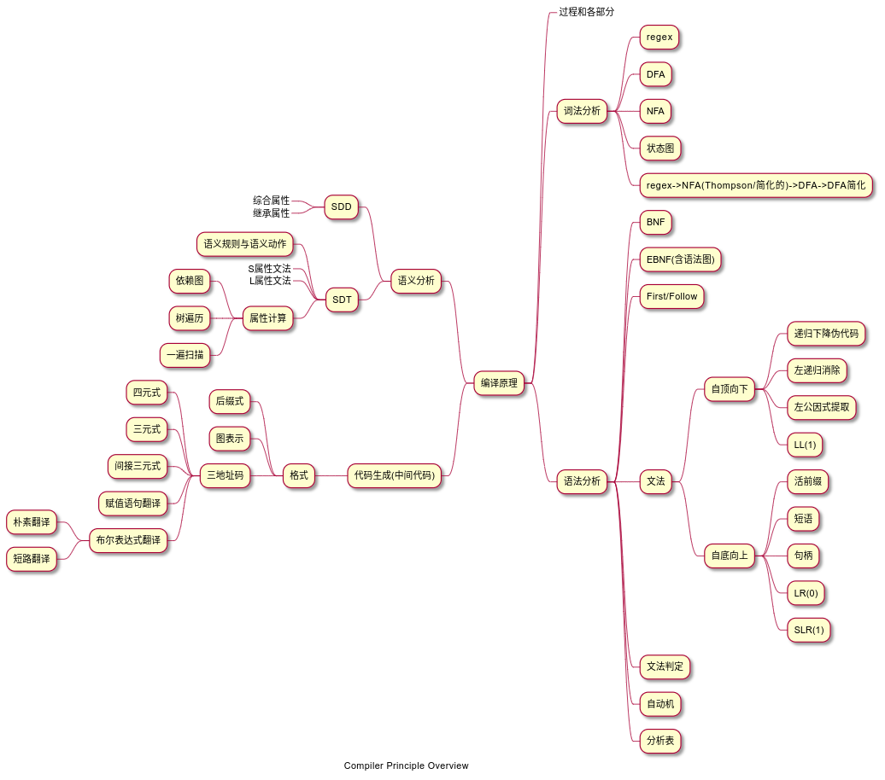

# 课程指导

~~可能会把一些书放在 `./pdf` 下~~

## 自学指导

B站 国防科技大学视频(跳过LR(1) 这部分应该不会考)

## 书籍推荐

- 虎书
- 鲸书
- 编译原理及实践 Kenneth C.Louden ~~老教材~~
- flex & bison

## 笔记

- 小知识点的[提示](compiler-hint.md)

思维导图使用plantuml绘制 [源文件](compiler.puml)

## 一些内容的链接

### BNF

- https://sighingnow.github.io/%E7%BC%96%E8%AF%91%E5%8E%9F%E7%90%86/bnf.html
- https://zhuanlan.zhihu.com/p/341145585